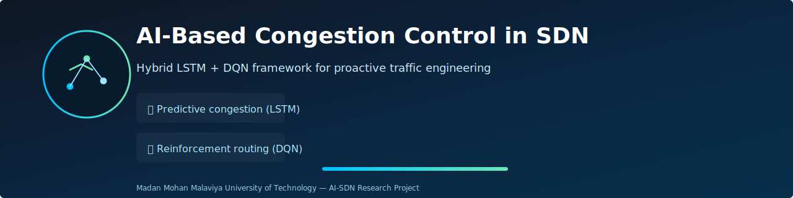

<div align="center">

# 🛰️ **AI-Based Congestion Control in SDN**
### 🚀 *Hybrid LSTM + DQN Framework for Intelligent, Proactive Traffic Engineering*



---

[](https://chat.qwen.ai/s/deploy/t_c71b65ef-a811-4795-97ee-73fd25bca398)
[](https://screenrec.com/share/tPUz4E7hH2)


---


### *“Predict congestion before it happens. Reroute traffic before failures occur.”*

</div>

---

# 🎥 **Demo Previews**

### 🔹 **GIF Preview (Working Application)**
*(Upload GIF later)*  
[ demo.gif ]

yaml
Copy code

### 🔹 **Full Video Demonstration**
🎬 https://screenrec.com/share/tPUz4E7hH2

---

# 📘 **Overview**

This is a **research-grade full-stack SDN-AI system** integrating:

- 🔮 **LSTM for congestion prediction**
- 🧠 **DQN for intelligent routing decisions**
- 🔌 **Ryu SDN controller for OpenFlow rule installation**
- 🧪 **Mininet topology emulation**
- 🖥️ **React dashboard**
- ⚙️ **Flask model server**

This repository is perfect for:

✔ M.Tech/B.Tech Thesis  
✔ IEEE/Elsevier Research Papers  
✔ Industry SDN-AI Prototypes  
✔ Academic Tutorials & Workshops  

---

# 🏗️ **Architecture (Mermaid Diagram)**

```mermaid
flowchart TD
    A[Mininet Hosts & Switches] -->|Telemetry| B[Ryu SDN Controller]
    B --> C[LSTM Predictor]
    B --> D[DQN Routing Agent]
    C --> E[Congestion Risk Score]
    D --> F[Optimal Path Decision]
    E --> B
    F --> B
    B -->|OpenFlow Rules| A
📂 Repository Structure
bash
Copy code
AI-SDN/
│
├── backend/        # Flask inference API
├── ryu_app/        # Ryu controller logic + AI integration
├── mininet/        # Topologies, iperf traffic, utilities
├── ai/             # Dataset, training scripts, LSTM/DQN models
├── frontend/       # React dashboard
│
├── assets/         # Banner, logo, GIFs, graphs
├── .env.example    # Environment template
└── README.md
⚡ Features
🔮 Predictive Congestion Control
LSTM forecasts link congestion 3–5 seconds ahead.

🧠 Intelligent Routing with DQN
Learns optimal routing with a custom reward function.

⚙️ Real-Time SDN Integration
Ryu installs OpenFlow rules instantly after decisions.

🧪 Rich Emulation Environment
Supports Fat-tree, Mesh, Linear, and Leaf-Spine networks.

📊 Dashboard
React UI shows congestion alerts, utilization, flows.

🛠️ Setup Guide
1️⃣ Install System Dependencies
bash
Copy code
sudo apt update
sudo apt install python3-pip python3-venv git -y
sudo apt-get install mininet -y
pip3 install ryu
2️⃣ Backend Setup
bash
Copy code
cd backend
python3 -m venv venv
source venv/bin/activate
pip install -r requirements.txt
cp .env.example .env
python server.py
3️⃣ Train LSTM/DQN Models
bash
Copy code
cd ai
python3 train_model.py
Produces:

Copy code
model.pkl
reward_curve.png
accuracy_graph.png
4️⃣ Run Ryu Controller
bash
Copy code
ryu-manager ryu_app/controller_ai.py
5️⃣ Start Mininet
bash
Copy code
sudo python3 mininet/topology.py
6️⃣ Launch React Dashboard
bash
Copy code
cd frontend
npm install
npm start
📡 Backend API Documentation
Endpoint	Method	Description
/predict	POST	Returns congestion probability
/stats	GET	Provides real-time port statistics
/route	POST	Computes optimal route via DQN
/health	GET	Health status of backend service

🧠 Dataset & Training
Input Features
Bandwidth usage

Packet drop rate

Queue length

RTT

Inter-arrival times

Training Details
Model	Epochs	Optimizer	Loss
LSTM	50	Adam	MSE
DQN	5k Episodes	Q-Learning	TD Error

📊 Performance Graphs (Placeholders)
css
Copy code
[ accuracy_graph.png ]
[ reward_curve.png ]
[ latency_comparison.png ]
🗺️ Project Roadmap
csharp
Copy code
✔ LSTM congestion predictor
✔ DQN intelligent routing agent
✔ SDN integration with Ryu
✔ Mininet support
✔ React frontend

⬜ Multi-agent RL support
⬜ Transformer-based predictor
⬜ sFlow/NetFlow integration
⬜ Intent-Based Networking (IBN)
⬜ GRPC-based fast telemetry plane
👥 Contributors
Name	Role
Aditya Kumar Maurya	Lead Developer / Research
Abhishek Yadav	SDN & Controller Logic
Sujal Gupta	AI Training & Integration

📄 License
This project is licensed under the MIT License.
Use freely for research and development.

📝 Citation
BibTeX
bibtex
Copy code
@thesis{maurya2025sdnai,
  title={AI-Based Congestion Control in SDN using LSTM and DQN},
  author={Maurya, Aditya Kumar and Yadav, Abhishek and Gupta, Sujal},
  school={MMMUT},
  year={2025}
}
📧 Contact
📨 Aditya Kumar Maurya
📩 adityamaurya@mmmut.ac.in
