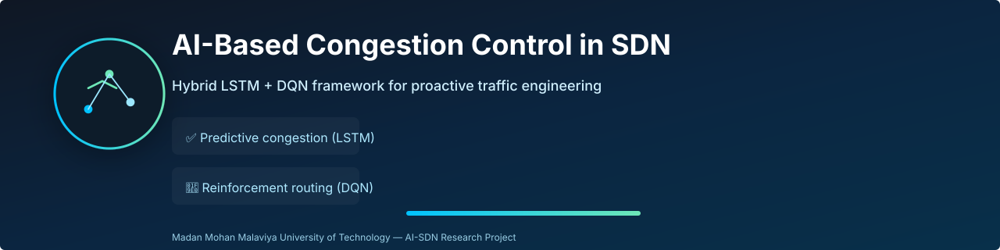
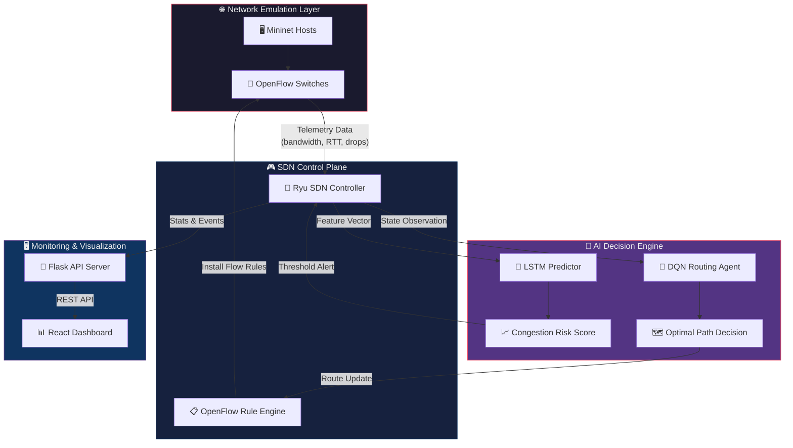
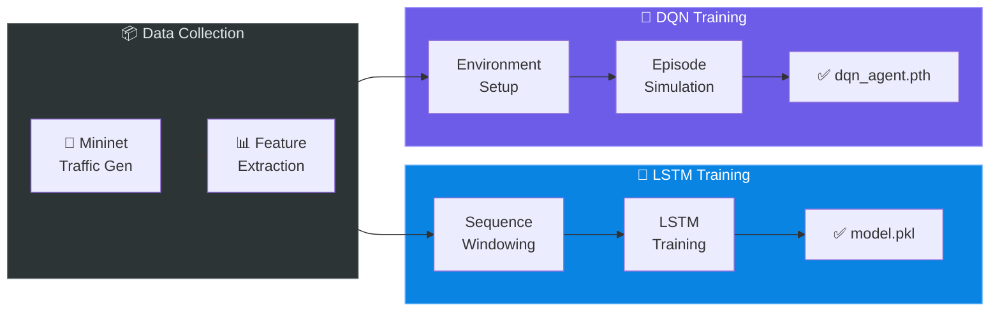

<div align="center">

# 🛰️ AI-Based Congestion Control in SDN

### 🚀 Hybrid LSTM + DQN Framework for Intelligent, Proactive Traffic Engineering



<br/>

[](https://chat.qwen.ai/s/deploy/t_c71b65ef-a811-4795-97ee-73fd25bca398)
[](https://screenrec.com/share/tPUz4E7hH2)
[](https://python.org)
[](https://ryu-sdn.org/)
[](http://mininet.org/)
[](https://pytorch.org/)
[](LICENSE)
[](https://github.com/aditya5289/AI-based-congestion-control-in-SDN/stargazers)

<br/>


<br/>

> ### *"Predict congestion before it happens. Reroute traffic before failures occur."*

</div>

<br/>

---

## 📑 Table of Contents

<details>
<summary>Click to expand</summary>

- [Demo Previews](#-demo-previews)
- [Overview](#-overview)
- [Key Features](#-key-features)
- [System Architecture](#%EF%B8%8F-system-architecture)
- [Project Structure](#-project-structure)
- [Setup Guide](#%EF%B8%8F-setup-guide)
- [Backend API Documentation](#-backend-api-documentation)
- [Dataset & Training](#-dataset--training)
- [Performance Graphs](#-performance-graphs)
- [Roadmap](#%EF%B8%8F-roadmap)
- [Contributors](#-contributors)
- [Citation](#-citation)
- [License](#-license)
- [Contact](#-contact)

</details>

---

## 🎥 Demo Previews

<div align="center">

### GIF Preview


> 💡 *GIF will be uploaded soon — stay tuned!*

<br/>

### 🎬 Full Video Demonstration

**[▶ Watch the Full Demo on ScreenRec](https://screenrec.com/share/tPUz4E7hH2)**

</div>

---

## 📘 Overview

This is a **research-grade, full-stack SDN-AI system** that brings together deep learning and software-defined networking for **proactive, intelligent traffic management**.

Unlike traditional reactive approaches, this system **predicts congestion 3–5 seconds in advance** using LSTM and **dynamically reroutes traffic** via a DQN-trained agent — all orchestrated in real-time through a Ryu SDN controller with OpenFlow rule installation.

<div align="center">

| Component | Technology | Role |
|:---------:|:----------:|:----:|
| 🔮 Predictor | **LSTM** | Congestion forecasting |
| 🧠 Agent | **DQN** | Intelligent routing decisions |
| 🔌 Controller | **Ryu SDN** | OpenFlow rule installation |
| 🧪 Emulation | **Mininet** | Network topology simulation |
| 🖥️ Frontend | **React** | Interactive dashboard |
| ⚙️ Backend | **Flask** | Model serving REST API |

</div>

### 🎯 Ideal For

| Audience | Use Case |
|:---------|:---------|
| 🎓 M.Tech / B.Tech Students | Thesis & capstone project with real working code |
| 📄 Researchers | IEEE / Elsevier paper reproducibility & baselines |
| 🏢 Industry Engineers | SDN-AI prototype for datacenter traffic engineering |
| 👨‍🏫 Educators | Ready-to-use academic tutorial & workshop material |

---

## ⚡ Key Features

| Feature | Description |
|:--------|:------------|
| 🔮 **Predictive Congestion Control** | LSTM forecasts link congestion **3–5 seconds ahead** using bandwidth, RTT, queue length & packet drop rates |
| 🧠 **Intelligent Routing with DQN** | Deep Q-Network learns optimal routing via custom reward function balancing latency, throughput & fairness |
| ⚙️ **Real-Time SDN Integration** | Ryu controller **instantly installs OpenFlow rules** based on AI inference — zero manual intervention |
| 🧪 **Rich Emulation Environment** | Supports **Fat-Tree, Mesh, Linear, and Leaf-Spine** topologies via Mininet |
| 📊 **Interactive Dashboard** | React UI displays live congestion alerts, link utilization heatmaps & flow rule tables |
| 🔌 **REST API Backend** | Flask-powered inference server with endpoints for prediction, routing & real-time stats |

---

## 🏗️ System Architecture


```mermaid
flowchart TD
    subgraph NET["🌐 Network Emulation Layer"]
        A["🖥️ Mininet Hosts"] --> S["🔀 OpenFlow Switches"]
    end

    subgraph CTRL["🎮 SDN Control Plane"]
        B["🔌 Ryu SDN Controller"]
        OF["📋 OpenFlow Rule Engine"]
    end

    subgraph AI_ENGINE["🧠 AI Decision Engine"]
        C["🔮 LSTM Predictor"]
        D["🎯 DQN Routing Agent"]
        E["📈 Congestion Risk Score"]
        F["🗺️ Optimal Path Decision"]
    end

    subgraph VIZ["🖥️ Monitoring & Visualization"]
        H["🔧 Flask API Server"]
        G["📊 React Dashboard"]
    end

    S -->|"Telemetry Data<br/>(bandwidth, RTT, drops)"| B
    B -->|"Feature Vector"| C
    B -->|"State Observation"| D
    C --> E
    D --> F
    E -->|"Threshold Alert"| B
    F -->|"Route Update"| OF
    OF -->|"Install Flow Rules"| S
    B -->|"Stats & Events"| H
    H -->|"REST API"| G

    style NET fill:#1a1a2e,stroke:#e94560,color:#eee
    style CTRL fill:#16213e,stroke:#0f3460,color:#eee
    style AI_ENGINE fill:#533483,stroke:#e94560,color:#eee
    style VIZ fill:#0f3460,stroke:#533483,color:#eee
```

### 🔄 Data Flow Pipeline

```
Hosts ──► Switches ──► [Telemetry] ──► Ryu Controller ──► [Features] ──► LSTM / DQN ──► [Decision] ──► OpenFlow Rules ──► Switches
                                              │
                                              └──► Flask API ──► React Dashboard
```

---

## 📂 Project Structure

```
AI-based-congestion-control-in-SDN/
│
├── 🧠 ai/                          # AI / ML Module
│   ├── train_model.py               #   Training pipeline (LSTM + DQN)
│   ├── lstm_model.py                #   LSTM congestion predictor
│   ├── dqn_agent.py                 #   DQN routing agent
│   ├── dataset/                     #   Training data (synthetic + captured)
│   └── models/                      #   Saved artifacts (.pkl, .pth)
│
├── ⚙️ backend/                      # Flask Inference Server
│   ├── server.py                    #   REST API endpoints
│   ├── requirements.txt             #   Python dependencies
│   └── .env.example                 #   Environment variable template
│
├── 🖥️ frontend/                     # React Dashboard
│   ├── src/                         #   React source components
│   ├── package.json                 #   Node.js dependencies
│   └── public/                      #   Static assets
│
├── 🔀 ryu_app/                      # Ryu SDN Controller Application
│   └── controller_ai.py             #   AI-integrated OpenFlow controller
│
├── 🧪 mininet/                      # Network Emulation
│   └── topology.py                  #   Custom Mininet topologies
│
├── 🎨 assets/                       # Media Assets
│   ├── logo.png                     #   Project logo
│   ├── demo.gif                     #   Demo GIF animation
│   └── *.png                        #   Performance graphs & screenshots
│
├── banner.svg                       # Header banner image
├── start_server.bat                 # Windows one-click launcher
├── Video Description                # Demo video details
├── .gitignore                       # Git ignore rules
└── README.md                        # ← You are here
```

---

## 🛠️ Setup Guide

### Prerequisites

| Tool | Version | Purpose |
|:-----|:-------:|:--------|
| **Python** | ≥ 3.8 | Core runtime |
| **Mininet** | ≥ 2.3.0 | Network emulation |
| **Ryu** | ≥ 4.34 | SDN controller framework |
| **Node.js** | ≥ 16.x | React dashboard |
| **Open vSwitch** | ≥ 2.13 | Virtual switch fabric |

---

<details>
<summary><b>1️⃣ Install System Dependencies</b></summary>

<br/>

```bash
sudo apt update && sudo apt upgrade -y
sudo apt install python3-pip python3-venv git curl -y
sudo apt-get install mininet openvswitch-switch -y
pip3 install ryu
```

</details>

<details>
<summary><b>2️⃣ Clone the Repository</b></summary>

<br/>

```bash
git clone https://github.com/aditya5289/AI-based-congestion-control-in-SDN.git
cd AI-based-congestion-control-in-SDN
```

</details>

<details>
<summary><b>3️⃣ Backend Setup (Flask API Server)</b></summary>

<br/>

```bash
cd backend
python3 -m venv venv
source venv/bin/activate
pip install -r requirements.txt
cp .env.example .env          # ← Configure your environment variables
python server.py              # ✅ Starts on http://localhost:5000
```

</details>

<details>
<summary><b>4️⃣ Train LSTM / DQN Models</b></summary>

<br/>

```bash
cd ai
python3 train_model.py
```

**📦 Output Artifacts:**

| File | Description |
|:-----|:------------|
| `model.pkl` | Trained LSTM congestion predictor |
| `reward_curve.png` | DQN training reward over episodes |
| `accuracy_graph.png` | LSTM prediction accuracy plot |

</details>

<details>
<summary><b>5️⃣ Run Ryu SDN Controller</b></summary>

<br/>

```bash
ryu-manager ryu_app/controller_ai.py
```

</details>

<details>
<summary><b>6️⃣ Start Mininet Topology</b></summary>

<br/>

```bash
sudo python3 mininet/topology.py
```

</details>

<details>
<summary><b>7️⃣ Launch React Dashboard</b></summary>

<br/>

```bash
cd frontend
npm install
npm start                     # ✅ Opens on http://localhost:3000
```

</details>

---

### ⚡ Quick Start (Windows)

```bash
start_server.bat              # One-click launch: backend + controller
```

---

## 📡 Backend API Documentation

| Endpoint | Method | Description | Sample Response |
|:---------|:------:|:------------|:----------------|
| `/predict` | **POST** | Returns congestion probability for a link | `{"risk": 0.87, "level": "HIGH"}` |
| `/stats` | **GET** | Real-time port statistics from Ryu | `{"ports": [...], "timestamp": "..."}` |
| `/route` | **POST** | Computes optimal route via DQN agent | `{"path": [1,3,5,7], "cost": 12.4}` |
| `/health` | **GET** | Backend health check | `{"status": "ok", "uptime": "2h 15m"}` |

<details>
<summary><b>📋 Example API Calls (cURL)</b></summary>

<br/>

```bash
# 🔮 Get congestion prediction
curl -X POST http://localhost:5000/predict \
  -H "Content-Type: application/json" \
  -d '{"link_id": "s1-s3", "features": [0.75, 12.3, 0.02, 45.6, 0.8]}'

# 📊 Get real-time stats
curl http://localhost:5000/stats

# 🧠 Compute optimal route
curl -X POST http://localhost:5000/route \
  -H "Content-Type: application/json" \
  -d '{"src": "h1", "dst": "h4"}'

# ❤️ Health check
curl http://localhost:5000/health
```

</details>

---

## 🧠 Dataset & Training

### Input Feature Vector

| # | Feature | Description | Unit |
|:-:|:--------|:------------|:----:|
| 1 | **Bandwidth Usage** | Current link utilization | Mbps |
| 2 | **Packet Drop Rate** | Dropped / total packets ratio | % |
| 3 | **Queue Length** | Buffer occupancy at switch port | pkts |
| 4 | **RTT** | Round-trip time measurement | ms |
| 5 | **Inter-Arrival Time** | Gap between consecutive packets | ms |

### Model Training Configuration

| Model | Architecture | Training Duration | Optimizer | Loss Function |
|:-----:|:-------------|:-----------------:|:---------:|:-------------:|
| **LSTM** | 2-layer, 128 hidden units | 50 epochs | Adam (lr=1e-3) | MSE |
| **DQN** | 3-layer MLP (256→128→64) | 5,000 episodes | ε-greedy Q-Learning | TD Error |

### 🔬 Training Pipeline


```mermaid
flowchart LR
    subgraph DATA["📦 Data Collection"]
        D1["🧪 Mininet<br/>Traffic Gen"] --> D2["📊 Feature<br/>Extraction"]
    end

    subgraph LSTM_T["🔮 LSTM Training"]
        D2 --> L1["Sequence<br/>Windowing"]
        L1 --> L2["LSTM<br/>Training"]
        L2 --> L3["✅ model.pkl"]
    end

    subgraph DQN_T["🎯 DQN Training"]
        D2 --> Q1["Environment<br/>Setup"]
        Q1 --> Q2["Episode<br/>Simulation"]
        Q2 --> Q3["✅ dqn_agent.pth"]
    end

    style DATA fill:#2d3436,stroke:#636e72,color:#dfe6e9
    style LSTM_T fill:#0984e3,stroke:#74b9ff,color:#fff
    style DQN_T fill:#6c5ce7,stroke:#a29bfe,color:#fff
```

---

## 📊 Performance Graphs

> 📈 *Graphs are auto-generated after running `python3 train_model.py`*

<div align="center">

| LSTM Accuracy | DQN Reward Curve | Latency Comparison |
|:-------------:|:----------------:|:------------------:|
|  |  |  |

</div>

---

## 🗺️ Roadmap

| Status | Milestone | Description |
|:------:|:----------|:------------|
| ✅ | **LSTM Congestion Predictor** | Time-series forecasting of link congestion |
| ✅ | **DQN Routing Agent** | Reinforcement learning for path optimization |
| ✅ | **Ryu SDN Integration** | OpenFlow rule installation from AI decisions |
| ✅ | **Mininet Emulation** | Multi-topology support (Fat-Tree, Mesh, Linear, Leaf-Spine) |
| ✅ | **React Dashboard** | Interactive real-time visualization of network state |
| 🔄 | **Multi-Agent RL** | Distributed agents for large-scale topologies |
| 🔜 | **Transformer Predictor** | Attention-based congestion forecasting |
| 🔜 | **sFlow / NetFlow Integration** | Production-grade telemetry collection |
| 🔜 | **Intent-Based Networking (IBN)** | High-level policy-driven network control |
| 🔜 | **gRPC Telemetry Plane** | Low-latency, high-throughput data pipeline |

---

## 👥 Contributors

<div align="center">

<table>
  <tr>
    <td align="center" width="260">
      <b>Aditya Kumar Maurya</b><br/>
      <sub>🎯 Lead Developer & Research</sub><br/><br/>
      <a href="mailto:adityamaurya@mmmut.ac.in">
        
      </a>
      <a href="https://github.com/aditya5289">
        
      </a>
    </td>
    <td align="center" width="260">
      <b>Abhishek Yadav</b><br/>
      <sub>🔌 SDN & Controller Logic</sub>
    </td>
    <td align="center" width="260">
      <b>Sujal Gupta</b><br/>
      <sub>🧠 AI Training & Integration</sub>
    </td>
  </tr>
</table>

<br/>

**🏛️ Madan Mohan Malaviya University of Technology (MMMUT), Gorakhpur**

</div>

---

## 📝 Citation

If you use this work in your research, please cite:

```bibtex
@thesis{maurya2025sdnai,
  title     = {AI-Based Congestion Control in SDN using LSTM and DQN},
  author    = {Maurya, Aditya Kumar and Yadav, Abhishek and Gupta, Sujal},
  school    = {Madan Mohan Malaviya University of Technology (MMMUT)},
  year      = {2025},
  type      = {M.Tech Thesis},
  url       = {https://github.com/aditya5289/AI-based-congestion-control-in-SDN}
}
```

---

## 📄 License

This project is licensed under the **MIT License** — free to use for research and development.

---

## 📧 Contact

📨 **Aditya Kumar Maurya** — [adityamaurya@mmmut.ac.in](mailto:adityamaurya@mmmut.ac.in)

---

<div align="center">

<br/>

### ⭐ Found this useful? Give it a star!

[](https://github.com/aditya5289/AI-based-congestion-control-in-SDN/stargazers)
[](https://github.com/aditya5289/AI-based-congestion-control-in-SDN/forks)
[](https://github.com/aditya5289/AI-based-congestion-control-in-SDN/watchers)

<br/>

Made with ❤️ at **MMMUT Gorakhpur** • © 2025

</div>
